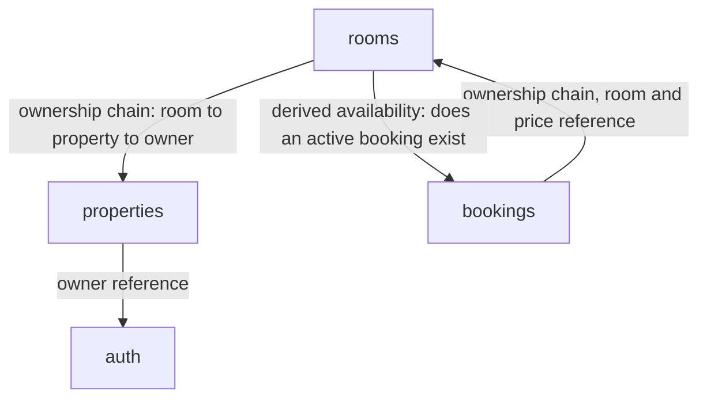

# Architecture

> **Draft, not yet earned.** Written before Task 0's package structure
> exists. The module boundaries and dependency edges below follow directly
> from the design spec's domain model, but they haven't been tested against
> real code yet — revisit this once the package structure exists (end of
> Task 0) and again as each module (Tasks 1, 4–8) is actually built.

## Modules

- **auth** — owns the `User` entity: identity fields, password hash, and the
  owner/boarder role. Owns registration, login, JWT issuance and
  validation, and refresh-token rotation/session enforcement (Redis-backed).
  Has no dependency on any other module.
- **properties** — owns the `Property` entity: owner reference, name,
  location, listed/unlisted flag. Owns create/edit/delist and the
  first ownership check (property.owner == authenticated user).
- **rooms** — owns the `Room` entity: property reference, price,
  description, its own listed/unlisted flag. Owns the ownership-chain walk
  one hop further (room → property → owner) and the property-delist
  cascade (a delisted property hides its rooms regardless of their own flag).
- **bookings** — owns the `Booking` entity: room and boarder references,
  dates, status, locked-in price. Owns the request/approve/reject/
  auto-reject/cancel/end lifecycle and the database constraint preventing
  double-occupancy.
- **shared** — no entities of its own. Owns cross-cutting concerns: security
  config, the central exception-to-HTTP-response mapping, and Redis access.

## Module dependency rules

Four allowed edges, each for exactly one reason:

- **properties → auth** — a property's owner is a `User`; properties only
  ever reads identity, never writes it.
- **rooms → properties** — a room belongs to a property; walking the
  ownership chain for a room action reads through to the property's owner.
- **bookings → rooms** — a booking references a room (for price capture at
  request time) and walks room → property → owner for owner-side actions
  (approve/reject/end).
- **rooms → bookings** — the one place this isn't a one-way tree: a room's
  availability is *derived*, never stored, so rooms must ask bookings
  whether an approved, not-yet-ended booking currently exists for it.

`rooms` and `bookings` depending on each other looks like a cycle, but each
direction is for a genuinely different, narrow reason — not two modules
fighting over the same responsibility. To keep it that way, each module
exposes only a small facade surface for the other to call (e.g. bookings
exposes `hasActiveBooking(roomId)`, not its full repository; rooms exposes
`getOwnerIdForRoom(roomId)`, not raw entity access) — nothing outside a
module reaches past that facade into its persistence layer directly.

Anything not listed above is forbidden — in particular, `properties` and
`bookings` never call each other directly; any interaction between them goes
through `rooms`.

## Layering inside a module

Every module uses the same internal shape — see
`conventions/kotlin-spring.md`: `web` (controllers, DTOs) → `service`
(business logic) → `persistence` (entities, repositories). Recorded once
there rather than duplicated here.

## Cross-cutting concerns

The `shared` module holds:

- **Security config** — the JWT authentication filter and
  `SecurityFilterChain` setup that every module's endpoints run through.
- **Error handling** — the central `@RestControllerAdvice` that turns
  exceptions into the 401/403/404 (plus 400/409) response shapes documented
  in `docs/api.md`.
- **Redis access** — the low-level Redis client/config that `auth` (tokens)
  and `rooms`/`bookings` (search cache, once built) sit on top of; see
  `conventions/redis.md` for the actual key scheme.
