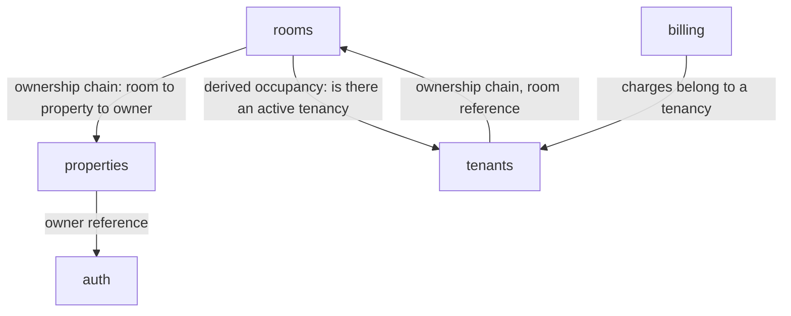

# Architecture

> **Operations app (post-pivot, ADR 0004).** The module boundaries and
> dependency edges below follow from the operations design and its decision
> records (ADRs 0005–0011). They describe the intended shape; revisit each
> module's section once it is actually built.

## Modules

- **auth** — owns the `User` entity: identity fields, password hash, and a role
  field. Owns registration, login, JWT issuance and validation, and
  refresh-token rotation / single-session enforcement (Redis-backed). For the
  MVP only owners are users (ADR 0008). Depends on no other module.
- **properties** — owns the `Property` entity: owner reference, name, location,
  active flag. Owns create / edit / deactivate and the first ownership check
  (`property.owner == authenticated user`).
- **rooms** — owns the `Room` entity: property reference, monthly rent (`BigDecimal`,
  ADR 0011), description, active flag. Owns the ownership-chain walk one hop
  further (room → property → owner), the property-deactivate cascade (a
  deactivated property hides its rooms), and *derived* occupancy — it asks the
  `tenants` module whether an active tenancy exists rather than storing an
  occupied flag (ADR 0007).
- **tenants** — owns the `Tenant` and `Tenancy` entities. A tenant is a record an
  owner manages (not a user). A tenancy ties a tenant to a room over a period,
  carries the move-in/out dates, the deposit, and the rent locked in at
  move-in. Owns the tenancy lifecycle (start / end) and the *one active tenancy
  per room* database constraint (ADR 0009).
- **billing** — owns the `Charge` and `Payment` entities: the periodic rent
  charges generated per tenancy (ADR 0006) and the payments recorded against
  them. Owns balance calculation ("who owes what"). This is the operations core.
- **shared** — no entities of its own. Owns cross-cutting concerns: security
  config, the central exception-to-HTTP-response mapping, and Redis access.

## Module dependency rules

Five allowed edges, each for exactly one reason:

- **properties → auth** — a property's owner is a `User`; properties only ever
  reads identity, never writes it.
- **rooms → properties** — a room belongs to a property; walking the ownership
  chain for a room action reads through to the property's owner.
- **tenants → rooms** — a tenancy references a room, and walks room → property →
  owner for the ownership check on tenancy actions.
- **rooms → tenants** — the one place this isn't a one-way tree: a room's
  occupancy is *derived* (ADR 0007), so rooms must ask tenants whether an active
  tenancy currently exists for it.
- **billing → tenants** — a charge belongs to a tenancy, and payments settle
  charges; billing walks tenancy → room → property → owner for its ownership
  checks.

`rooms` and `tenants` depending on each other looks like a cycle, but each
direction is a different, narrow reason — not two modules fighting over one
responsibility. Each module exposes only a small **facade** for the other to
call (e.g. tenants exposes "is there an active tenancy for this room", rooms
exposes "give me the owner id for this room") — nothing outside a module reaches
past that facade into its persistence layer directly. See
`conventions/kotlin-spring.md` §7.

Anything not listed above is forbidden — in particular `properties` and
`billing` never call each other directly; any interaction routes through the
chain (`billing → tenants → rooms → properties`).

## Layering inside a module

Every module uses the same internal shape — `web` (controllers, DTOs, mappers) →
`service` (business logic) → `persistence` (entities, repositories). The
dependency direction is always downward. Recorded in full in
`conventions/kotlin-spring.md` §1 rather than duplicated here.

## Cross-cutting concerns

The `shared` module holds:

- **Security config** — the JWT authentication filter and `SecurityFilterChain`
  that every module's endpoints run through.
- **Error handling** — the central `@RestControllerAdvice` that turns exceptions
  into the 400 / 401 / 403 / 404 / 409 response shapes documented in
  `docs/api.md`.
- **Redis access** — the low-level Redis config that `auth` (tokens) and, later,
  `billing` (report caching, if built) sit on top of; see `conventions/redis.md`
  for the key scheme.
