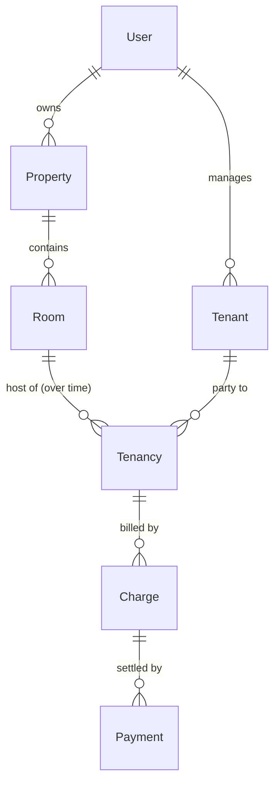

# Data Model

> **Operations app (post-pivot, ADR 0004).** Entities and rules for the
> owner-only MVP. Money is integer centavos throughout (ADR 0005). All fields are
> described in prose — you write the actual classes.

## Entities

### User  — module: `auth`

The account of an owner. (Tenants are not users — ADR 0008.)

| Field | Type (prose) | Notes |
|---|---|---|
| id | generated number | database-assigned |
| email | text, unique | login identifier; uniqueness enforced by the database |
| passwordHash | text | BCrypt hash; the plaintext password is never stored |
| role | enum | `OWNER` for the MVP; the field exists so `TENANT`/`STAFF` can be added later without reshaping identity |
| createdAt | timestamp | set on registration |

### Property  — module: `properties`

A boarding house. The container rooms live under.

| Field | Type | Notes |
|---|---|---|
| id | generated number | |
| ownerId | reference → User | set from the authenticated identity, never from client input |
| name | text | |
| location | text | free-form for the MVP |
| active | boolean | deactivate instead of delete (ADR 0010); defaults true |

### Room  — module: `rooms`

A rentable unit inside a property.

| Field | Type | Notes |
|---|---|---|
| id | generated number | |
| propertyId | reference → Property | |
| label | text | e.g. "Room 1", "Unit A" |
| monthlyRentCents | number (centavos) | the current asking rent; ADR 0005 |
| description | text, optional | |
| active | boolean | ADR 0010 |

**Deliberate absence:** a Room has **no** stored occupancy/`occupied` field.
Occupancy is derived by asking whether an active tenancy exists (ADR 0007).
Storing it would be a second source of truth that drifts.

### Tenant  — module: `tenants`

A person the owner rents to. A record, not an account (ADR 0008).

| Field | Type | Notes |
|---|---|---|
| id | generated number | |
| ownerId | reference → User | the owner who manages this tenant |
| name | text | |
| phone | text, optional | |
| email | text, optional | contact only — not a login |
| createdAt | timestamp | |

### Tenancy  — module: `tenants`

The link between a tenant and a room over a period of time. This is where the
rent is locked in.

| Field | Type | Notes |
|---|---|---|
| id | generated number | |
| tenantId | reference → Tenant | |
| roomId | reference → Room | |
| monthlyRentCents | number (centavos) | **captured from the room's rent at move-in** and never changed afterward — a later edit to the room's rent does not alter an ongoing tenancy (the lease-price-lock principle, mirroring ADR 0006's reasoning) |
| depositCents | number (centavos) | amount held; ADR 0005 |
| startDate | date | move-in |
| endDate | date, nullable | move-out; **empty while the tenancy is ongoing** |

**"Active" is derived:** a tenancy is active when its `startDate` has arrived and
its `endDate` is empty or in the future. There is no stored status field.

### Charge  — module: `billing`

One period's rent owed for a tenancy (ADR 0006).

| Field | Type | Notes |
|---|---|---|
| id | generated number | |
| tenancyId | reference → Tenancy | |
| periodYearMonth | year-month | the month this charge is for; unique per tenancy (a tenancy can't be charged twice for the same month) |
| amountCents | number (centavos) | copied from the tenancy's locked rent at generation time |
| dueDate | date | |
| createdAt | timestamp | |

A charge's **outstanding balance** is `amountCents` minus the sum of its
payments. It is derived, not stored — the same single-source-of-truth reasoning
as occupancy.

### Payment  — module: `billing`

Money received, recorded against a specific charge.

| Field | Type | Notes |
|---|---|---|
| id | generated number | |
| chargeId | reference → Charge | the period this payment settles |
| amountCents | number (centavos) | must not exceed the charge's outstanding balance in the MVP (overpayment/credit deferred) |
| paidOn | date | |
| note | text, optional | e.g. "GCash ref 12345" |

## Relationships

Cardinalities in prose: an owner has many properties and many tenants; a property
has many rooms; a room has many tenancies *over time* but **at most one active at
once** (ADR 0009); a tenant has many tenancies over time; a tenancy has many
charges (one per month); a charge has zero or more payments.

## Tenancy lifecycle

| State (derived) | Meaning | Reached from |
|---|---|---|
| Upcoming | `startDate` is in the future | on creation with a future start |
| Active | started, not yet ended | `startDate` arrives |
| Ended | `endDate` is set and past | the owner records a move-out |

The rule that hangs off this: **what frees a room** is the tenancy no longer
being active — i.e. an `endDate` that has been set. A freed room immediately
becomes assignable again because occupancy is derived live (ADR 0007), with no
flag to reset.

## Integrity rules enforced by the database

- **At most one active tenancy per room** — a partial uniqueness rule that
  applies only to active (open-ended) tenancy rows. This prevents two tenants
  being assigned to the same room even under concurrent requests; the service
  turns the violation into a `409`. Full reasoning and the rejected alternatives
  are in **ADR 0009**.
- **Unique email per user** — a plain uniqueness constraint on `User.email`; a
  duplicate registration fails cleanly rather than creating a second account.
- **One charge per tenancy per month** — a uniqueness rule on
  (`tenancyId`, `periodYearMonth`) so a period can't be double-billed.

Each of these lives at the database layer on purpose: the database is the single
arbiter that stays correct even under concurrency or an application bug.
